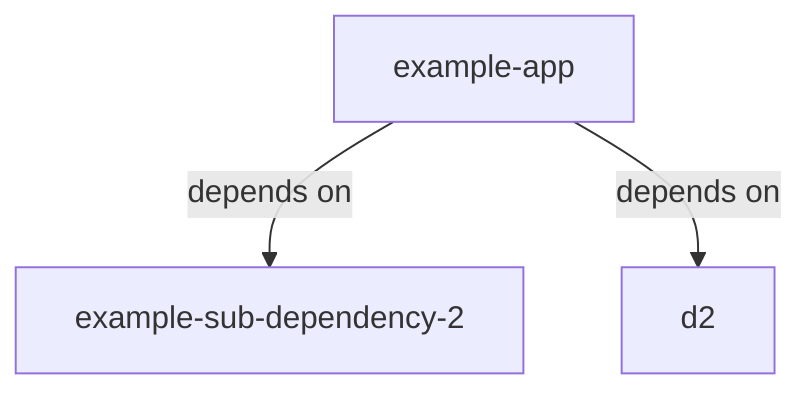

# little multi module gradle project

```mermaid
flowchart TD
    app[example-app]
    d1[example-sub-dependency-1]
    d1[example-sub-dependency-2]
    
    app -- depends on --> d1
    app -- depends on --> d2
```